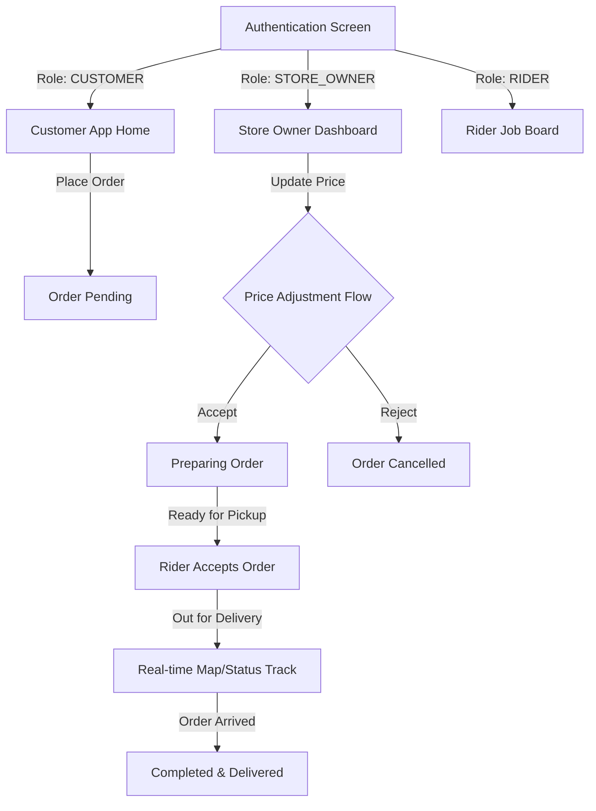

# CampusChow - Comprehensive App Documentation

CampusChow is a feature-rich, multi-role campus food and delivery platform built with Flutter. It is designed to connect **Customers**, **Store Owners**, and **Riders** on campus in a single unified ecosystem with real-time tracking, secure payments, and dynamic price adjustments.

---

## 🏗 System Architecture & Tech Stack

CampusChow uses a modular clean-architecture design on the client-side combined with a robust Node.js backend.

### Frontend Tech Stack
*   **Core Framework**: [Flutter SDK (v3.11.5+)](https://flutter.dev) & Dart.
*   **State Management**: [Provider](https://pub.dev/packages/provider) for reactive state updates across screens.
*   **Dependency Injection**: [GetIt](https://pub.dev/packages/get_it) as a service locator for managing repositories and singletons.
*   **Navigation & Routing**: [GoRouter](https://pub.dev/packages/go_router) for handling deep linking, tab shell structures, and role-based redirects.
*   **Real-time Communication**: [Ably Flutter](https://pub.dev/packages/ably_flutter) for low-latency websockets sync (order status, notification events).
*   **API Client**: [Dio](https://pub.dev/packages/dio) with custom interceptors for token management.
*   **Storage**: `shared_preferences` (settings, theme) and `flutter_secure_storage` (auth credentials).
*   **Styling & Micro-animations**: `flutter_screenutil` (responsive scaling) and `flutter_animate` (transitions).

### Backend Tech Stack
*   **Core**: Next.js App Router API.
*   **Database**: MongoDB & Mongoose.
*   **Auth Provider**: Firebase Auth (Admin SDK).
*   **Testing**: [Vitest](https://vitest.dev) for super-fast API and unit testing.

---

## 👥 Multi-Role User Flows & Functionalities

CampusChow provides tailor-made flows depending on the user's role: `CUSTOMER`, `STORE_OWNER`, and `RIDER`.

### 1. Customer Flow

#### 🔐 Secure Authentication & Onboarding
*   **Multiple Auth Providers**: Standard Email/Password registration along with Google Sign-in.
*   **Authentication Check**: Token-based validation checks on launch. Custom JWTs, Firebase Session Cookies, and Firebase ID Tokens are supported seamlessly.
*   **Role Redirects**: Redirects the user to the correct sub-application shell on login.

#### 🍔 Store Browsing & Customization
*   **Store Index**: Live dashboard showing open stores on campus, complete with categories, ratings, tags, and average delivery times.
*   **Customizable Items**: Interactive item sheets allowing selections of sizes (e.g., Small, Medium, Large) and modifiers (e.g., meat choices, extra sides, drinks).
*   **Price Calculator**: Dynamically adjusts prices in real-time on the sheet as options are selected.

#### 🛒 Shopping Cart & Tiered Service Fees
*   **Single-Store Enforcement**: The cart prevents adding items from different stores. If a customer attempts to add an item from another store, they are prompted to clear their current cart first.
*   **Tiered Service Fees**: Calculates service fees dynamically based on the subtotal:
    *   Subtotal under ₦2,000: service fee is ₦150.
    *   Subtotal under ₦5,000: service fee is ₦250.
    *   Subtotal ₦5,000 and above: service fee is ₦350.
*   **Promo Codes**: Supports percentage-based promotional codes with a maximum cap limit (e.g., 20% off up to ₦1,000).

#### 💳 Checkout & Payments
*   **Delivery Types**: Supports both `delivery` and `pickup`.
*   **Priority Shipping**: Offers a priority delivery option for a flat surcharge (e.g., ₦150) which gets marked as `isPriority` to grab riders' attention.
*   **Paystack Integration**: Secure payment link generation and payment callback handler for order validation.
*   **Wallet Deduction**: Optional wallet-based payment.

---

### 2. Store Owner (Restaurant) App

Located inside the `lib/store/` directory, this dashboard allows restaurant operators to manage store settings, catalogs, and orders.

#### 📦 Catalog & Menu Management
*   Add, edit, or delete menu items.
*   Define custom choices, sizes, and modifier rules.
*   Set item availability toggles (e.g., "Out of Stock").

#### 📝 Real-time Order Management
*   **Order Intake**: Receive order placements instantly via Ably notifications with customized sound alerts (`order_sound.mp3`).
*   **Status Management**: Move orders through stages: `Pending` ➔ `Preparing` ➔ `Ready for Pickup`.
*   **Price Adjustment Feature**: If an item becomes unavailable or requires substitution, store owners can adjust the prices of items in an order. This moves the order into `priceAdjusted` status and prompts the customer.

---

### 3. Rider App

A dashboard for campus couriers to pick up orders and earn delivery fees.

#### 🛵 Live Job Board
*   View all available delivery requests sorted by priority (`isPriority`) and proximity.
*   Accept orders with one tap.

#### 📍 Order Delivery Flow
*   Access store location, customer delivery coordinates, and notes.
*   Update order status: `Accepted` ➔ `Picked Up` ➔ `Delivered`.
*   Publish live location markers to the Customer's order tracker.

---

## ⚡ Key Live Mechanics

### 📡 Real-time Synchronization (Ably)
Real-time state updates are broadcast using **Ably channels** so users never need to refresh screens manually:
1.  **User Notifications Channel**: `user_<userId>` — receives background events like payments.
2.  **Order Channel**: `order_<orderId>` — updates both store, rider, and customer apps on status transitions or chat events.

### ⚠️ Price Adjustment Negotiation Flow
Allows dynamic post-placement modifications, preventing order cancellation when menu items go out of stock:

1.  **Store Owner Adjusts Price**: Updates the order item list and sets a new subtotal.
2.  **Order State Changes**: The order moves to `OrderStatus.priceAdjusted`.
3.  **Customer Panel Warning**: A `PriceAdjustmentPanel` appears in the customer's [OrderDetailsScreen](file:///Users/admin/Downloads/code/nodejs/project/campuschow_mobile/lib/screens/tabs/order_details_screen.dart):
    *   Shows the original total.
    *   Shows the updated total.
    *   Calculates the **Balance to Pay** (if the price went up) or **Refund Amount** (if the price went down).
4.  **Acceptance**: Tapping **Pay Balance** (or **Accept Refund**) sends a POST request to the API, captures any balance payment, and shifts the status back to `ACCEPTED` so preparation can begin.
5.  **Rejection**: Tapping **Cancel Order** rejects the adjustment, cancels the transaction, and releases any held funds to the user's wallet.

---

## 🧪 Testing and Quality Control

Both frontend and backend are covered by tests to ensure high quality and prevent regressions:

### 1. Mobile App Tests
Run tests using: `flutter test`
*   **Unit Tests**:
    *   `cart_item_test.dart`: Serialization, same-slot comparison.
    *   `cart_provider_test.dart`: Item additions, single-store constraint, tiered service fees, promo code caps.
    *   `order_repository_test.dart`: Payment initialization, price adjustments.
    *   `price_calculator_test.dart`: Customization summary generation, size selections.
    *   `theme_provider_test.dart`: Dark/light mode persistence.
*   **Widget Tests**:
    *   `price_adjustment_widget_test.dart`: Simulates pressing `Pay Balance` / `Cancel Order` buttons in the `PriceAdjustmentPanel` and verifies API calls.

---

## ⚠️ Known Issues

### iOS: Swift Package Manager (SPM) Warnings
During `flutter build ipa`, warnings may appear stating that some plugins (`sign_in_with_apple`, `permission_handler_apple`, `flutter_secure_storage`, `ably_flutter`) do not support Swift Package Manager.
*   **Status**: These warnings indicate a future deprecation of CocoaPods-only support.
*   **Resolution**: No immediate action is required. The project currently relies on CocoaPods for iOS dependency management, and these plugins remain fully functional. This will be monitored for future updates to these plugins to facilitate a smooth migration when required.
